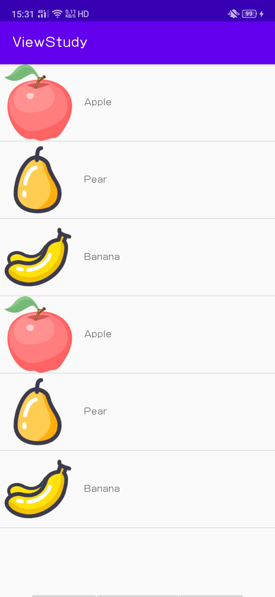

# Android中的UI组件

## 常用控件的使用方法

### TextView

> TextView是Android中最简单的一个空间，主要用于在界面上显示一段文本信息。

```xml
<?xml version="1.0" encoding="utf-8"?>
<LinearLayout
    xmlns:android="http://schemas.android.com/apk/res/android"
    xmlns:tools="http://schemas.android.com/tools"
    android:layout_width="match_parent"
    android:layout_height="match_parent"
    tools:context=".MainActivity">
    <TextView
        android:id="@+id/text_view"
        android:layout_width="wrap_content"
        android:layout_height="wrap_content"
        android:gravity="center"
        android:text="Hello World!"
        android:textSize="24sp"
        android:textColor="#00ff00"/>

  </LinearLayout>
```

- `android:id`:给当前控件一定了一个唯一标识符;
- `android:text`: 指定了TextView中显示的文本内容;
- `android:layout_height`和`android:layout_width`: 分别指定了空间的高度和宽度;其中可选则属性值为:
  - `match_parent`和`fill_parent`:表示让当前的控件的大小和父布局的大小一样，也就是由父布局来决定当前控件的大小;
  - `wrap_content`: 标识让当前控件大小能够刚好包住里面的内容，也就是由控件的内容决定当前控件的大小;
- `android:gravity`: 来指定文字的对齐方式。可选值有`top`,`bottom`,`left`,`right`,`center`等，可以用`|`来同时指定多个值，这里我们指定的`center`，效果等同于`center_vertical|center_horizontal`,表示文字在垂直和水平方向都居中对齐。
- `android:textSize`:属性可以指定文字的大小,在Android中文字大小使用`sp`作为单位。
- `android:textColor`:属性可以指定文字的颜色。
- 还有很多属性...

### Button

> Button是程序用于和用户交互的一个重要控件;

```xml
    <Button
        android:id="@+id/button1"
        android:layout_width="match_parent"
        android:layout_height="wrap_content"
        android:text="Button" />
```

> 需要注意的是，我们在布局文件里设置的文字是`Button`，但最终显示的结果却是`BUTTON`。这是由于系统会对Button中的所有英文字母自动进行大写转换 ，可以使用如下配置禁用这一默认特性:
>
> `android:textAllCaps="false"`

Button一般用于与用户交互，需要监听用户的点击事件，并做出相应的响应。为Button的点击事件注册一个监听器：

```java
public class MainActivity extends AppCompatActivity {

    @Override
    protected void onCreate(Bundle savedInstanceState) {
        super.onCreate(savedInstanceState);
        setContentView(R.layout.activity_main);
        Button button1 = findViewById(R.id.button1);
        // 使用匿名类的方式来注册监听器
        //button1.setOnClickListener(new View.OnClickListener(){
        //    @Override
        //    public void onClick(View v) {
        //        Toast.makeText(MainActivity.this, "clicked Button", Toast.LENGTH_SHORT).show();
        //    }
        //});
        // 使用lambda表达式来注册监听器
        button1.setOnClickListener((v) -> {
            Toast.makeText(MainActivity.this, "click Button", Toast.LENGTH_SHORT).show();
        });
    }
}
```

以上是使用匿名类以及lambda表达式的形式进行注册监听器，还可以使用实现接口的方式进行,如下：

```java
public class MainActivity extends AppCompatActivity implements View.OnClickListener {

    @Override
    protected void onCreate(Bundle savedInstanceState) {
        super.onCreate(savedInstanceState);
        setContentView(R.layout.activity_main);
        Button button1 = findViewById(R.id.button1);
        // 使用实现接口的形式来注册监听器
        button1.setOnClickListener(this);
    }

    @Override
    public void onClick(View v) {
        switch (v.getId()) {
            case R.id.button1:
                Toast.makeText(MainActivity.this, "clicked Button", Toast.LENGTH_SHORT).show();
                break;
            default:
                break;
        }
    }
}
```

### EditText

> EditText是程序用于和用户进行交互的另一个重要控件，它允许用户在控件中输入和编辑内容，并可以在程序中对这些内容进行处理。

```xml
    <EditText
        android:id="@+id/editText1"
        android:layout_width="match_parent"
        android:layout_height="wrap_content"
        android:hint="输入一些内容"
        android:maxLines="2"/>
```

- `android:hint`:属性指定了一段提示性文本。
- `android:maxLines`:属性指定了EditText的最大行数为两行，这样当输入的内容超过两行时，文本就会向上滚动，而EditText则不会再继续拉伸。

我们还可以利用EditText做一些与用户交互的功能，比如通过点击按钮获得EditText中输入的内容。如下：

```java
public class MainActivity extends AppCompatActivity implements View.OnClickListener {
    private EditText editText;
    @Override
    protected void onCreate(Bundle savedInstanceState) {
        super.onCreate(savedInstanceState);
        setContentView(R.layout.activity_main);
        Button button1 = findViewById(R.id.button1);

        // 获取editText
        editText = findViewById(R.id.editText1);
        button1.setOnClickListener(this);

    }

    @Override
    public void onClick(View v) {
        switch (v.getId()) {
            case R.id.button1:
                String str = editText.getText().toString();
                Toast.makeText(MainActivity.this, str, Toast.LENGTH_SHORT).show();
                break;
            default:
                break;
        }
    }
}
```

### ImageView

> ImageView是用于在界面上展示图片的一个控件，它可以让我们的程序界面变的丰富多彩。

```xml
    <ImageView
        android:id="@+id/image_view"
        android:layout_width="wrap_content"
        android:layout_height="wrap_content"
        android:src="@drawable/img_1"/>
```

- `android:src`: 可以通过该属性给ImageView指定一张图片。

我们还可以通过代码动态的更改ImageView中的图片，如下：

```java
public class MainActivity extends AppCompatActivity implements View.OnClickListener {
    private ImageView imageView;
    @Override
    protected void onCreate(Bundle savedInstanceState) {
        super.onCreate(savedInstanceState);
        setContentView(R.layout.activity_main);
        Button button1 = findViewById(R.id.button1);

        // 获取imageView
        imageView = findViewById(R.id.image_view);
        // 使用实现接口的形式来注册监听器
        button1.setOnClickListener(this);

    }

    @Override
    public void onClick(View v) {
        switch (v.getId()) {
            case R.id.button1:
                imageView.setImageResource(R.drawable.img_2);
                break;
            default:
                break;
        }
    }
}
```

### ProgressBar

> ProgressBar用于在界面上显示一个进度条，表示我们的程序正在加载一些数据。

```xml
    <ProgressBar
        android:id="@+id/progress_bar"
        android:layout_width="match_parent"
        android:layout_height="wrap_content"/>
```

- `android:visibility`: 所有的Android都具有这个属性，Android控件的可见属性。可选值有`visible`,`invisible`,`gone`:
  - `visible`: 表示控件可见;
  - `invisible`: 表示控件不可见，但是控件仍然占据原来的位置和大小;
  - `gone`：则表示控件不可见，且不再占用任何屏幕空间。

  我们还可以通过代码控制控件的可见性,使用的是`setVisibility()`方法，方法可传入`View.VISIBLE`, `VIEW.INVISIBLE`, `VIEW.GONE` .

```java
public class MainActivity extends AppCompatActivity implements View.OnClickListener {
    private ProgressBar progressBar;
    @Override
    protected void onCreate(Bundle savedInstanceState) {
        super.onCreate(savedInstanceState);
        setContentView(R.layout.activity_main);
        Button button1 = findViewById(R.id.button1);

        // 获取progressBar
        progressBar = findViewById(R.id.progress_bar);
        // 使用实现接口的形式来注册监听器
        button1.setOnClickListener(this);

    }

    @Override
    public void onClick(View v) {
        switch (v.getId()) {
            case R.id.button1:
                if (progressBar.getVisibility() == View.GONE) {
                    progressBar.setVisibility(View.VISIBLE);
                } else {
                    progressBar.setVisibility(View.GONE);
                }
                break;
            default:
                break;
        }
    }
}
```

我们还可以给ProgressBar设置不同的样式，可以将上面的圆形进度条，通过style属性将他指定为水平进度条。

还可以通过`andoird:max`属性给进度条设置一个最大值，然后在代码中动态的改变进度条的值。

```xml
    <ProgressBar
        android:id="@+id/progress_bar"
        android:layout_width="match_parent"
        android:layout_height="wrap_content"
        style="?android:attr/progressBarStyleHorizontal"
        android:max="100"/>
```

动态的改变水平进度条的值：

```java
public class MainActivity extends AppCompatActivity implements View.OnClickListener {
    private ProgressBar progressBar;
    @Override
    protected void onCreate(Bundle savedInstanceState) {
        super.onCreate(savedInstanceState);
        setContentView(R.layout.activity_main);
        Button button1 = findViewById(R.id.button1);


        // 获取progressBar
        progressBar = findViewById(R.id.progress_bar);

        // 使用实现接口的形式来注册监听器
        button1.setOnClickListener(this);

    }

    @Override
    public void onClick(View v) {
        switch (v.getId()) {
            case R.id.button1:
                // 设置水平进度条的值
                int progress = progressBar.getProgress();
                progress += 10;
                progressBar.setProgress(progress);
                break;
            default:
                break;
        }
    }
}
```

### AlertDialog

> AlertDialog可以在当前的界面弹出一个对话框，这个对话框置顶于所有的界面元素之上的，能够屏蔽掉其他控件的交互能力，因此AlertDialog一般用于提示一些非常重要的内容或者警告信息。

```java
public class MainActivity extends AppCompatActivity implements View.OnClickListener {
    @Override
    protected void onCreate(Bundle savedInstanceState) {
        super.onCreate(savedInstanceState);
        setContentView(R.layout.activity_main);
        Button button1 = findViewById(R.id.button1);

        // 使用实现接口的形式来注册监听器
        button1.setOnClickListener(this);

    }

    @Override
    public void onClick(View v) {
        switch (v.getId()) {
            case R.id.button1:
                // 对话框
                AlertDialog.Builder dialog = new AlertDialog.Builder(MainActivity.this);
                // 设置对话框标题
                dialog.setTitle("This is Dialog");
                // 设置对话框内容
                dialog.setMessage("Something important.");
                // 可否用Back键关闭对话框
                dialog.setCancelable(false);
                // 设置确认按钮的点击事件
                dialog.setPositiveButton("OK", new DialogInterface.OnClickListener() {
                    @Override
                    public void onClick(DialogInterface dialog, int which) {
                    }
                });
                // 设置取消按钮的点击事件
                dialog.setNegativeButton("Cancel", new DialogInterface.OnClickListener() {
                    @Override
                    public void onClick(DialogInterface dialog, int which) {
                    }
                });
                // 将对话框显示出来
                dialog.show();
                break;
            default:
                break;
        }
    }
}
```

### ProgressDialog

> ProgresDialog和AlertDialog有点类似，都可以在界面上弹出一个对话框，都能够屏蔽掉其他控件的交互能力。不同的是，ProgressDialog会在对话框中显示一个进度条，一般用于表示当前操作比较耗时，让用户耐心等待。

```java
public class MainActivity extends AppCompatActivity implements View.OnClickListener {
    @Override
    protected void onCreate(Bundle savedInstanceState) {
        super.onCreate(savedInstanceState);
        setContentView(R.layout.activity_main);
        Button button1 = findViewById(R.id.button1);


        // 使用实现接口的形式来注册监听器
        button1.setOnClickListener(this);

    }

    @Override
    public void onClick(View v) {
        switch (v.getId()) {
            case R.id.button1:
                // ProgressDialog
                ProgressDialog progressDialog = new ProgressDialog(MainActivity.this);
                // 设置标题
                progressDialog.setTitle("This is ProgressDialog");
                // 设置内容
                progressDialog.setMessage("Loading...");
                // 设置是否可以通过Back键取消
                progressDialog.setCancelable(true);
                // 显示
                progressDialog.show();
                break;
            default:
                break;
        }
    }
}
```

## 四种基本布局

> 布局是一种可用于放置很多控件的容器，它可以按照一定的规律调整内部控件的位置，从而编写处精美的页面。当然，除了放置控件之外，也可以放置布局，通过多层布局的嵌套，我们就能够完成一些比较复杂的界面实现。

### 线性布局

> `LinearLayout`又被称之为线性布局，是一种非常常用的布局。正如他名字所描述的那样，这个布局会将它所包含的控件在线性方向上依次排列。

```xml
<?xml version="1.0" encoding="utf-8"?>
<LinearLayout xmlns:android="http://schemas.android.com/apk/res/android"
    android:layout_height="match_parent"
    android:layout_width="match_parent"
    android:orientation="vertical">

    <Button
        android:layout_width="wrap_content"
        android:layout_height="wrap_content"
        android:text="Button 1"/>

    <Button
        android:layout_width="wrap_content"
        android:layout_height="wrap_content"
        android:text="Button 2"/>

    <Button
        android:layout_width="wrap_content"
        android:layout_height="wrap_content"
        android:text="Button 3"/>

</LinearLayout>
```

> `android:orientation`该属性指定排列的方向，`veritical`: 指定了垂直方向上排列，`horizontal`: 指定了水平方向上排列。默认的排列方向则是`horizontal`水平方向排列。

布局中的对齐方式怎么设置呢？如下所示：

```xml
<?xml version="1.0" encoding="utf-8"?>
<LinearLayout xmlns:android="http://schemas.android.com/apk/res/android"
    android:layout_height="match_parent"
    android:layout_width="match_parent"
    android:orientation="vertical">

    <Button
        android:layout_width="wrap_content"
        android:layout_height="wrap_content"
        android:text="Button 1"
        android:layout_gravity="left"
        />

    <Button
        android:layout_width="wrap_content"
        android:layout_height="wrap_content"
        android:layout_gravity="center_horizontal"
        android:text="Button 2"/>

    <Button
        android:layout_width="wrap_content"
        android:layout_height="wrap_content"
        android:layout_gravity="right"
        android:text="Button 3"/>

</LinearLayout>
```

> `android:layout_gravity`和之前的`android:gravity`属性有些类似，但`android:gravity`用于指定文字在控件中的对齐方式，而`andoird:layout_gravity`用于指定控件在布局中的对齐方式。属性值都差不多；

> 但是需要注意的是，当布局的排列方向为`vertical`，只有水平方向的对齐方式是有效的，同理，当布局的排列方向为`horizontal`，只有垂直方向的对齐方式是有效的。

`android:layout_weight`，这个属性允许我们使用比例的方式来指定控件的大小

```xml
<?xml version="1.0" encoding="utf-8"?>
<LinearLayout xmlns:android="http://schemas.android.com/apk/res/android"
    android:layout_height="match_parent"
    android:layout_width="match_parent"
    android:orientation="horizontal">


    <EditText
        android:id="@+id/input_message"
        android:layout_width="0dp"
        android:layout_height="wrap_content"
        android:layout_weight="1"
        android:hint="Type somethine"/>

    <Button
        android:id="@+id/send"
        android:layout_width="0dp"
        android:layout_height="wrap_content"
        android:layout_weight="1"
        android:text="send"/>

</LinearLayout>
```

> 这里我们将两个控件的宽度均设置为`0dp`,由于我们使用了`andoird:layout_weight`属性，此时的控件宽度不再由`android:layout_width`来决定。

> 在`EditText`和`Button`里都将`android:layout_weight`设置为1，这表示`EditText`和`Button`将在水平方向上评分宽度。

> 原理： 系统会把`LinearLayout`下所有控件指定的`layout_weight`值相加，得到一个总值，然后每个控件所占的大小的比例就是用该控件的`layout_weight`值除以刚才算出的总值。

### 相对布局

> `RelativeLayout`又被称作相对布局，也是一种非常常用的布局。它可以通过相对定位的方式让控件出现在布局的任何位置。

```xml
<?xml version="1.0" encoding="utf-8"?>
<RelativeLayout xmlns:android="http://schemas.android.com/apk/res/android"
    android:layout_width="match_parent"
    android:layout_height="match_parent"
    >

    <Button
        android:layout_width="wrap_content"
        android:layout_height="wrap_content"
        android:layout_alignParentTop="true"
        android:layout_alignParentLeft="true"
        android:text="Button 1"/>

    <Button
        android:layout_width="wrap_content"
        android:layout_height="wrap_content"
        android:layout_alignParentRight="true"
        android:layout_alignParentTop="true"
        android:text="Button 2"/>

    <Button
        android:layout_width="wrap_content"
        android:layout_height="wrap_content"
        android:layout_centerInParent="true"
        android:text="Button 3"/>

    <Button
        android:layout_width="wrap_content"
        android:layout_height="wrap_content"
        android:layout_alignParentBottom="true"
        android:layout_alignParentLeft="true"
        android:text="Button 4"/>

    <Button
        android:layout_width="wrap_content"
        android:layout_height="wrap_content"
        android:layout_alignParentRight="true"
        android:layout_alignParentBottom="true"
        android:text="Button 5"/>

</RelativeLayout>
```

> 以上`android:layout_alignParentRight`...都是相对于父布局进行定位的。那控件可不可以相对于控件进行定位呢？

```xml
<?xml version="1.0" encoding="utf-8"?>
<RelativeLayout xmlns:android="http://schemas.android.com/apk/res/android"
    android:layout_width="match_parent"
    android:layout_height="match_parent"
    >

    <Button
        android:id="@+id/button4"
        android:layout_width="wrap_content"
        android:layout_height="wrap_content"
        android:layout_centerInParent="true"
        android:text="Button 1"/>

    <Button
        android:id="@+id/button5"
        android:layout_width="wrap_content"
        android:layout_height="wrap_content"
        android:layout_above="@id/button4"
        android:layout_toLeftOf="@id/button4"
        android:text="Button 2"/>

    <Button
        android:id="@+id/button6"
        android:layout_width="wrap_content"
        android:layout_height="wrap_content"
        android:layout_above="@id/button4"
        android:layout_toRightOf="@id/button4"
        android:text="Button 3"/>

    <Button
        android:layout_width="wrap_content"
        android:layout_height="wrap_content"
        android:layout_below="@id/button4"
        android:layout_toLeftOf="@id/button4"
        android:text="Button 4"/>

    <Button
        android:layout_width="wrap_content"
        android:layout_height="wrap_content"
        android:layout_below="@id/button4"
        android:layout_toRightOf="@id/button4"
        android:text="Button 5"/>

</RelativeLayout>
```

>-  `android:layout_above`: 该控件在目标控件的上方；
>- `android:layout_below`: 该控件在目标控件的下方；
>- `android:layout_toRightOf`: 该控件在目标控件的右边；
>- `android:layout_toLeftOf`: 该控件在目标控件的左边；

> 注意：当一个控件去引用另一个控件的id时，该控件一定要定义在引用控件的后面，不然会出现找不到id的情况。

还有另一组相对于控件进行定位的属性：

- `android:layout_alignLeft`: 表示让一个控件的左边缘和另一个控件的左边缘对齐；
- `android:layout_alignRight`: 表示让一个控件的右边缘和另一个控件的右边缘对齐；
- `android:layout_alignTop`: 表示让一个控件的头部和另一个控件对齐；
- `android:layout_alignBottom`: 同理。

### 帧布局 

> `FrameLayout`又被称为帧布局，它相对于前面两种布局就简单太多了。这种布局没有方便的定位方式，所有的控件都会默认摆放在布局的左上角。

```xml
<?xml version="1.0" encoding="utf-8"?>
<FrameLayout xmlns:android="http://schemas.android.com/apk/res/android"
    android:layout_height="match_parent"
    android:layout_width="match_parent">
    <TextView
        android:layout_height="wrap_content"
        android:layout_width="wrap_content"
        android:text="This is TextView"
        />

    <ImageView
        android:layout_width="wrap_content"
        android:layout_height="wrap_content"
        android:layout_gravity="right"
        android:src="@mipmap/ic_launcher"/>
</FrameLayout>
```

> 默认摆放在左上角，我们可以通过`androiod:layout_gravity`调节控件的对齐方式，将其放置在右上角。由于定位方式的欠缺，应用场景比较少。

### 百分比布局

> 在这种布局中，不再使用`wrap_content`,`match_parent`等方式来指定空间的大小，而是允许指定控件在布局中所占的百分比，这样的话可以轻松的实现平分布局甚至是任意比例分割布局的效果了。

> 由于`LinearLayout`本身 已经支持按比例指定控件的大小了，因此百分比布局只为`FrameLayout`和`RelativeLayout`进行了功能扩展，提供了`PercentFrameLayout`和`PercentRelativeLayout`这两个全新布局。

> 不同于以上三种布局，百分比布局属于新增布局。Android团队将百分比布局定义在了support库中，我们只需要在项目的`build.gradle`中添加百分比布局的依赖，就能保证百分比布局在Android所有系统版本上的兼容性了。

```groovy
dependencies {
    implementation fileTree(dir: "libs", include: ["*.jar"])
    implementation 'androidx.appcompat:appcompat:1.1.0'
    implementation 'androidx.constraintlayout:constraintlayout:1.1.3'
    implementation 'com.android.support:percent:27.1.1'
    testImplementation 'junit:junit:4.13'
    androidTestImplementation 'androidx.test.ext:junit:1.1.1'
    androidTestImplementation 'androidx.test.espresso:espresso-core:3.2.0'
}
```

```xml
<?xml version="1.0" encoding="utf-8"?>
<androidx.percentlayout.widget.PercentFrameLayout
    xmlns:android="http://schemas.android.com/apk/res/android"
    xmlns:app="http://schemas.android.com/apk/res-auto"
    android:layout_height="match_parent"
    android:layout_width="match_parent"
    >
    <Button
        android:text="Button1"
        android:layout_gravity="left|top"
        app:layout_widthPercent="50%"
        app:layout_heightPercent="50%"
        />

    <Button
        android:text="Button2"
        android:layout_gravity="right|top"
        app:layout_widthPercent="50%"
        app:layout_heightPercent="50%"
        />

    <Button
        android:text="Button3"
        android:layout_gravity="left|bottom"
        app:layout_widthPercent="50%"
        app:layout_heightPercent="50%"
        />

    <Button
        android:text="Button4"
        android:layout_gravity="right|bottom"
        app:layout_widthPercent="50%"
        app:layout_heightPercent="50%"
        />

</androidx.percentlayout.widget.PercentFrameLayout>
```

> 最外层我们使用了`PercentFrameLayout`，由于百分比布局并不是内置在系统SDK当中的，所以需要把完整的包名路径写出来。然后还必须定义一个app的命名空间，这样才能 使用百分比布局的自定义属性。

- `app:layout_widthPercent`: 该属性将各个按钮的宽度设置为布局的50%;
- `app:layout_heightPercent`:该属性将各个按钮的高度设置为布局的50%。

## 自定义控件

> 我们所用的所有控件都是直接或者间接继承自View的，所用的所有布局都是直接或者间接继承自ViewGroup的。
>
> View是Android中最基本的一种UI组件，它可以在屏幕上绘制一块矩形区域，并能响应这块区域的各种事件，因此我们使用的各种控件其实就是在View的基础之上添加了各自特有的功能。
>
> ViewGroup则是一种特殊的View，它可以包含很多子View和子ViewGroup，是一个用于放置控件或者布局的容器。

### 引入布局

在`layout`目录下新建一个标题栏的布局文件`title.xml`,如下所示：

```xml
<?xml version="1.0" encoding="utf-8"?>
<LinearLayout xmlns:android="http://schemas.android.com/apk/res/android"
    android:layout_width="match_parent"
    android:layout_height="wrap_content"
    android:background="@drawable/ic_launcher_background">

    <Button
        android:id="@+id/title_back"
        android:layout_width="wrap_content"
        android:layout_height="wrap_content"
        android:layout_gravity="center"
        android:layout_margin="5dp"
        android:text="Back"
        android:textColor="#fff"
        />

    <TextView
        android:id="@+id/title_text"
        android:layout_width="0dp"
        android:layout_height="wrap_content"
        android:layout_gravity="center"
        android:layout_weight="1"
        android:gravity="center"
        android:text="Title Text"
        android:textColor="#fff"
        android:textSize="24dp"
        />

    <Button
        android:id="@+id/title_edit"
        android:layout_width="wrap_content"
        android:layout_height="wrap_content"
        android:layout_gravity="center"
        android:layout_margin="5dp"
        android:text="Edit"
        android:textColor="#fff"
        />
</LinearLayout>
```

然后我们就可以在任何的布局文件中引用这个布局文件：

```xml
<?xml version="1.0" encoding="utf-8"?>
<androidx.constraintlayout.widget.ConstraintLayout xmlns:android="http://schemas.android.com/apk/res/android"
    xmlns:app="http://schemas.android.com/apk/res-auto"
    xmlns:tools="http://schemas.android.com/tools"
    android:layout_width="match_parent"
    android:layout_height="match_parent"
    tools:context=".ViewActivity">

    <include layout="@layout/title"/>

</androidx.constraintlayout.widget.ConstraintLayout>
```

使用这种方式我们就不需要重复的去写布局文件，只需要一行include语句就可以了。

我们还需要把系统自带的标题栏隐藏掉:

```java
public class ViewActivity extends AppCompatActivity {

    @Override
    protected void onCreate(Bundle savedInstanceState) {
        super.onCreate(savedInstanceState);
        setContentView(R.layout.activity_view);
        ActionBar actionBar = getSupportActionBar();
        if (actionBar != null) {
            actionBar.hide();
        }
    }
}
```

### 创建自定义控件

> 引入布局的技巧确实解决了重复编写布局代码的问题，但是如果布局中有一些控件要求能够响应事件，我们还需要在每个活动中为这些控件单独编写一次事件注册的代码。这个我们可以使用自定义控件的方式来解决：

```java
public class TitleLayout extends LinearLayout {
    public TitleLayout(Context context, @Nullable AttributeSet attrs) {
        super(context, attrs);
        // 对标题栏布局进行动态加载
        LayoutInflater.from(context).inflate(R.layout.title, this);
        Button titleBack = findViewById(R.id.title_back);
        Button titleEdit = findViewById(R.id.title_edit);
        titleBack.setOnClickListener((v)-> {
            ((Activity) getContext()).finish();
        });
        titleEdit.setOnClickListener((v)-> {
            Toast.makeText(context, "You click edit", Toast.LENGTH_SHORT).show();
        });
    }
}
```

如何在布局文件中添加这个自定义控件？

```xml
<?xml version="1.0" encoding="utf-8"?>
<androidx.constraintlayout.widget.ConstraintLayout xmlns:android="http://schemas.android.com/apk/res/android"
    xmlns:app="http://schemas.android.com/apk/res-auto"
    xmlns:tools="http://schemas.android.com/tools"
    android:layout_width="match_parent"
    android:layout_height="match_parent"
    tools:context=".ViewActivity">

    <net.qipo.viewstudy.TitleLayout
        android:layout_width="match_parent"
        android:layout_height="wrap_content"/>

</androidx.constraintlayout.widget.ConstraintLayout>
```

> 这样返回按钮和编辑按钮的点击事件就已经自动实现好了，省去了很多编写重复代码的工作。


## 控件ListView

> ListView绝对是Android上最常用的控件之一，几乎所有的应用程序都会用到它。ListView允许用户通过手指上下滑动的方式将屏幕外的数据滚动到屏幕内，同时屏幕上原有的数据则会滚动出屏幕。

### ListView的简单用法

> 加入ListView控件

```xml
<?xml version="1.0" encoding="utf-8"?>
<androidx.constraintlayout.widget.ConstraintLayout xmlns:android="http://schemas.android.com/apk/res/android"
    xmlns:app="http://schemas.android.com/apk/res-auto"
    xmlns:tools="http://schemas.android.com/tools"
    android:layout_width="match_parent"
    android:layout_height="match_parent"
    tools:context=".ListViewActivity">

    <ListView
        android:id="@+id/list_view"
        android:layout_width="match_parent"
        android:layout_height="match_parent"/>

</androidx.constraintlayout.widget.ConstraintLayout>
```

> 既然ListView是用于展示大量数据的，那我们应该把数据提供好。不过，数组中的数据时无法直接传递给ListView的，我们需要借助适配器来完成。Android中提供了很多适配器的实现类，其中我们使用的是ArrayAdapter，他可以通过泛型来指定要适配的数据类型，然后在构造函数中把要适配的数据传入。

```java

public class ListViewActivity extends AppCompatActivity {

    private String[] data = { "apple", "pear", "banana", "orange", "watermelon", "grape",
            "pineapple" , "strawberry", "cherry", "mango", "apple", "pear", "banana", "orange", "watermelon", "grape",
            "pineapple" , "strawberry", "cherry", "mango" };

    @Override
    protected void onCreate(Bundle savedInstanceState) {
        super.onCreate(savedInstanceState);
        setContentView(R.layout.activity_list_view);
        ArrayAdapter<String> adapter = new ArrayAdapter<String>(
                ListViewActivity.this, android.R.layout.simple_list_item_1, data
        );
        ListView listView = findViewById(R.id.list_view);
        listView.setAdapter(adapter);
    }
}
```

### 定制ListView的界面

> 如何如何对ListView界面进行定制呢？

首先定义实体类，作为ListView适配器的适配类型。

```java
public class Fruit {
    private  String name;
    private int imageId;

    public Fruit(String name, int imageId) {
        this.name = name;
        this.imageId = imageId;
    }

    public String getName() {
        return name;
    }

    public int getImageId() {
        return imageId;
    }
}

```

然后为 ListView的子项指定一个我们自定义的布局

```xml
<?xml version="1.0" encoding="utf-8"?>
<LinearLayout xmlns:android="http://schemas.android.com/apk/res/android"
    android:layout_width="match_parent"
    android:layout_height="match_parent">


    <ImageView
        android:id="@+id/fruit_image"
        android:layout_width="wrap_content"
        android:layout_height="wrap_content"/>

    <TextView
        android:id="@+id/fruit_name"
        android:layout_width="wrap_content"
        android:layout_height="wrap_content"
        android:layout_gravity="center_vertical"
        android:layout_marginStart="10dp"
        />
</LinearLayout>
```

接下来创建一个自定义的适配器，这个适配器继承自ArrayAdapter，并将泛型指定为Fruit类


```java
public class FruitAdapter extends ArrayAdapter {
    private int resourceId;
    public FruitAdapter(@NonNull Context context, int resource, @NonNull List<Fruit> objects) {
        super(context, resource, objects);
        resourceId = resource;
    }

    @NonNull
    @Override
    public View getView(int position, @Nullable View convertView, @NonNull ViewGroup parent) {
        Fruit fruit = (Fruit) getItem(position); // 获取当前项的Fruit实例
        // false 表示只让我们在父布局中声明的layout属性生效，但不会为这个View添加父布局，因为一旦View有了父布局之后，它就不能再添加到ListView中了
        View view = LayoutInflater.from(getContext()).inflate(resourceId, parent, false);
        TextView fruitName = view.findViewById(R.id.fruit_name);
        ImageView fruitImage = (ImageView) view.findViewById(R.id.fruit_image);
        fruitImage.setImageResource(fruit.getImageId());
        fruitName.setText(fruit.getName());
        return view;
    }
}
```

> 重写了父类的构造函数，用于将上下文，ListView子项布局的id和数据都传递进来。
>
> 重写了`getView()`方法。这个方法在每个子项被滚动到屏幕内的时候被调用。在该方法中，首先通过`getIteam()`方法得到当前项的Fruit实例，然后通过LayoutInflater来为这个子项加载我们传入的布局。

```java
public class ListViewActivity extends AppCompatActivity {

    private List<Fruit> fruitList = new ArrayList<>();
    @Override
    protected void onCreate(Bundle savedInstanceState) {
        super.onCreate(savedInstanceState);
        setContentView(R.layout.activity_list_view);
        // 初始化水果数据
        initFruits();
        FruitAdapter adapter = new FruitAdapter(ListViewActivity.this, R.layout.fruit_item, fruitList);
        ListView listView  = findViewById(R.id.list_view);
        listView.setAdapter(adapter);
    }

    private void initFruits() {
        for (int i = 0; i < 2; i ++) {
            Fruit apple = new Fruit("Apple",R.drawable.apple);
            fruitList.add(apple);
            Fruit pear = new Fruit("Pear", R.drawable.pear);
            fruitList.add(pear);
            Fruit banana = new Fruit("Banana", R.drawable.banana);
            fruitList.add(banana);
        }
    }
}
```

运行程序，效果如下图所示。




### 提升ListView的运行效率

> 目前`ListView`运行效率是很低的，因为在`FruitAdapter`的`getView()`方法中，每次都将布局重新加载了一遍。
>
> `getView()`方法中还有一个`convertView`参数，这个参数用于将之前加载好的布局进行缓存，以便之后可以进行重用。

```java
public class FruitAdapter extends ArrayAdapter {
    private int resourceId;
    public FruitAdapter(@NonNull Context context, int resource, @NonNull List<Fruit> objects) {
        super(context, resource, objects);
        resourceId = resource;
    }

    @NonNull
    @Override
    public View getView(int position, @Nullable View convertView, @NonNull ViewGroup parent) {
        Fruit fruit = (Fruit) getItem(position); // 获取当前项的Fruit实例
        View view;
        if (convertView == null) {
            view = LayoutInflater.from(getContext()).inflate(resourceId, parent, false);
        } else {
            view = convertView;
        }
        TextView fruitName = view.findViewById(R.id.fruit_name);
        ImageView fruitImage = (ImageView) view.findViewById(R.id.fruit_image);
        fruitImage.setImageResource(fruit.getImageId());
        fruitName.setText(fruit.getName());
        return view;
    }
}
```

> 我们现在在`getView()`方法中进行判断，如果`convertView`为`null`，则使用`ViewInflater`去加载布局，如果不为`null`则直接对`convertView`进行重用。

但是每次`getView()`的时候还是会调用View的`findViewById()`方法来获取一次控件的实例。可以借助ViewHolder来对这部分进行性能优化。

```java
public class FruitAdapter extends ArrayAdapter<Fruit> {
    private int resourceId;
    public FruitAdapter(@NonNull Context context, int resource, @NonNull List<Fruit> objects) {
        super(context, resource, objects);
        resourceId = resource;
    }

    @NonNull
    @Override
    public View getView(int position, @Nullable View convertView, @NonNull ViewGroup parent) {
        Fruit fruit = getItem(position); // 获取当前项的Fruit实例
        View view;
        ViewHolder viewHolder;
        if (convertView == null) {
            view = LayoutInflater.from(getContext()).inflate(resourceId, parent, false);
            viewHolder = new ViewHolder();
            viewHolder.fruitImage = view.findViewById(R.id.fruit_image);
            viewHolder.fruitName = view.findViewById(R.id.fruit_name);
            view.setTag(viewHolder); // 将ViewHolder存储在view中
        } else {
            view = convertView;
            viewHolder = (ViewHolder) view.getTag(); // 重新获取ViewHolder
        }
        viewHolder.fruitName.setText(fruit.getName());
        viewHolder.fruitImage.setImageResource(fruit.getImageId());
        return view;
    }
}

class ViewHolder {
    ImageView fruitImage;
    TextView fruitName;
}
```

> 这样所有控件的实例都缓存到了ViewHolder中，就没有必要每次都通过`findViewById()`方法来获取控件实例了。

### ListView的点击事件

> ListView如何才能响应用户点击

```java
public class ListViewActivity extends AppCompatActivity {

//    private String[] data = { "apple", "pear", "banana", "orange", "watermelon", "grape",
//            "pineapple" , "strawberry", "cherry", "mango", "apple", "pear", "banana", "orange", "watermelon", "grape",
//            "pineapple" , "strawberry", "cherry", "mango" };

    private List<Fruit> fruitList = new ArrayList<>();
    @Override
    protected void onCreate(Bundle savedInstanceState) {
        super.onCreate(savedInstanceState);
        setContentView(R.layout.activity_list_view);
        // 初始化水果数据
        initFruits();
        FruitAdapter adapter = new FruitAdapter(ListViewActivity.this, R.layout.fruit_item, fruitList);
        ListView listView  = findViewById(R.id.list_view);
        listView.setAdapter(adapter);
        // 点击任何一个子项，都会回调该方法
        // 通过positon参数可以判断出用户点击的是哪个子项
        listView.setOnItemClickListener((parent, view, position, id) -> {
            Fruit fruit = fruitList.get(position);
            Toast.makeText(ListViewActivity.this, fruit.getName(), Toast.LENGTH_SHORT).show();
        });
    }

    private void initFruits() {
        for (int i = 0; i < 5; i ++) {
            Fruit apple = new Fruit("Apple",R.drawable.apple);
            fruitList.add(apple);
            Fruit pear = new Fruit("Pear", R.drawable.pear);
            fruitList.add(pear);
            Fruit banana = new Fruit("Banana", R.drawable.banana);
            fruitList.add(banana);
        }
    }
}
```


